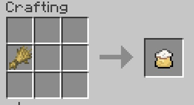
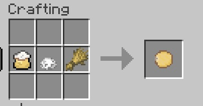
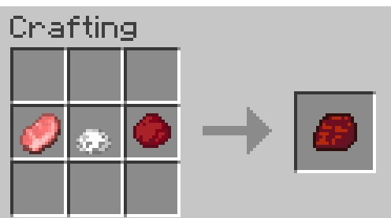
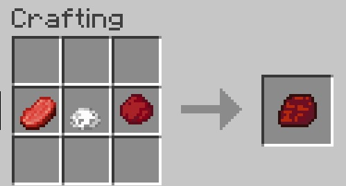
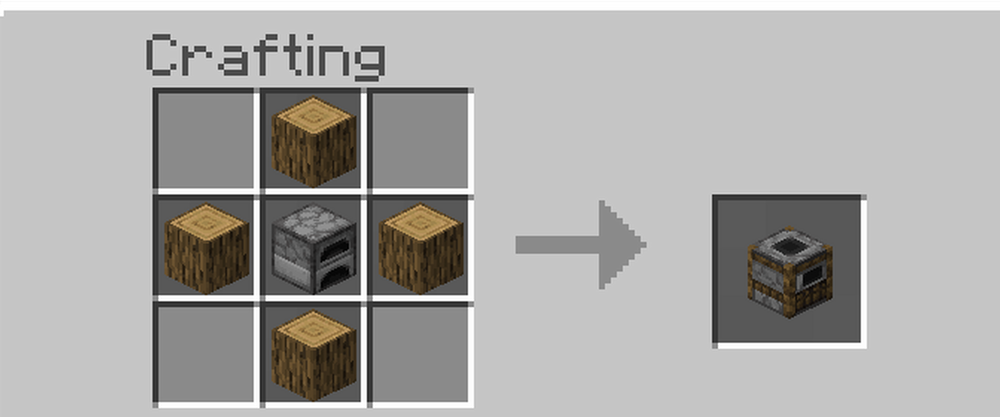
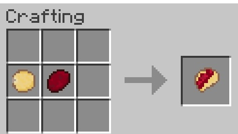
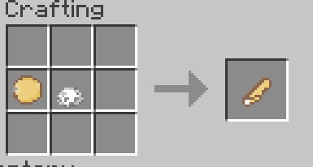

# De la calle al craft

Este mod agrega al mundo de Minecraft la experiencia culinaria de preparar tacos al pastor y los clasicos tacos de sal, desde la recolección de ingredientes hasta el poder cocinar y preparar tú mismo..

# Lista de items nuevos:

- **Harina**
- **Sal**
- **Achiote**
- **Tortilla**
- **Carne preparada** (carne + achiote)
- **Asador del trompo**
- **Carne de pastor cruda**
- **Carne de pastor picada**
- **Tacos de pastor**
- **Tacos de sal**

# Progresión del Jugador - Mod de Tacos al Pastor
##  Recolección de Insumos

La progresión del mod iniciando desde cero en un mundo en supervivencia sería de la siguiente manera:

- **Chile achiote:**  
  Se consigue chile achiote a partir de un arbusto de este dandole clic derecho una vez ya esté crecido el arbusto, estos spawnean de manera natural en la savana

- **Carne (cerdo o res):**  
  Se obtiene al matar vacas o cerdos, igual que en el juego tradicional.

- **Sal:**  
  Se puede conseguir sal al picar la estalactita nuevamente creada con un pico de cualquier calidad

- **Trigo:**  
  Se cultiva y recolecta de la manera tradicional en el juego.

---

##  Preparación de las Tortillas

1. **Harina**  
   Se craftea en la mesa de trabajo con **1 de trigo** en cualquier posición.

2. **Tortilla**  
   Se craftea con los siguientes ingredientes en la mesa de crafteo:
   - 1 harina  
   - 1 sal  
   - 1 trigo (colocado de forma horizontal)

---

##  Preparación de la Carne

- **Pastor crudo**  
  Se craftea en una mesa de trabajo con:
  - 1 chuleta (cerdo o res)  
  - 1 achiote  
  - 1 sal  
  Esto genera un nuevo ítem: **Carne de pastor cruda**.

---

##  Construcción del Asador y Trompo

- **Asador**  
  En este caso se utilizara el ahumador del juego tradicional 

--

## Cocinar la Carne

Para cocinar la carne se utiliza el **ahumador**:

1. Coloca combustible en el ahumador.
2. Añade la carne de pastor cruda.
3. Obtendrás **carne de pastor cocinada**.

---

##  Craftear los Tacos

- **Taco al pastor**  
  Se craftea en una mesa de trabajo con:
  - 1 tortilla  
  - 1 carne de pastor cocinada 

- **Taco de sal**  
  Se craftea en una mesa de trabajo con:
  - 1 tortilla  
  - 1 sal

